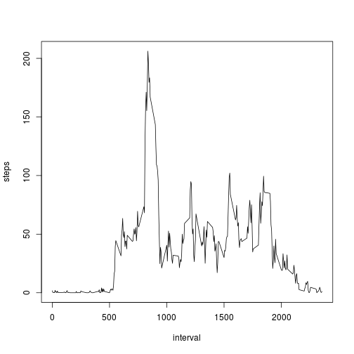

## Loading and preprocessing the data


```r
unzip('activity.zip')
act.df <- read.csv('activity.csv', header = TRUE)
act.df$date <- as.Date(act.df$date)

# Set the locale explicitly so that days appear with english names in the plots.
os <- tolower(Sys.info()['sysname'])
localestring <- if (os == 'windows') 'English' else if (os == 'linux') 'en_US.utf8' else 'en_US'
Sys.setlocale("LC_TIME", localestring)
```

```
## [1] "en_US.utf8"
```

## What is mean total number of steps taken per day?

To get the total number of steps per day, we need to group the observations by day and sum the steps in each group. 
This can be accomplished with the ```aggregate()``` function.


```r
steps.per.day <- aggregate(steps ~ date, data = act.df, FUN = sum)
```

Histogram of the total number of steps taken each day:


```r
with(steps.per.day, hist(steps))
```

 

Mean of the total number of steps taken per day:


```r
mean(steps.per.day$steps)
```

```
## [1] 10766.19
```

Median of the total number of steps taken per day:


```r
median(steps.per.day$steps)
```

```
## [1] 10765
```


## What is the average daily activity pattern?

Average number of steps for each 5-minute interval:


```r
steps.per.interval <- aggregate(steps ~ interval, data = act.df, FUN = mean)
```

Time series plot of the 5-minute interval (x-axis) and the average number of steps taken, averaged across all days (y-axis):


```r
with(steps.per.interval, plot(steps ~ interval, type = 'l'))
```

 

The 5-minute interval with the maximum average number of steps across all the days in the dataset:


```r
steps.per.interval[steps.per.interval$steps == max(steps.per.interval$steps), 'interval']
```

```
## [1] 835
```

## Imputing missing values

Total number of missing values in the dataset (i.e. the total number of rows with NAs):


```r
nrow(act.df[!complete.cases(act.df), ])
```

```
## [1] 2304
```

Fill in the missing values. Strategy: for each row with missing number of steps, use the mean for the corresponding 5-minute interval.


```r
# Build a new column, where the average number of steps for the interval is stored
act.df <- merge(act.df, steps.per.interval, by = 'interval', suffixes = c('', '.nasfilled'))

# In rows with missing number of steps, copy the value from the 'steps.nasfilled' column
act.df[is.na(act.df$steps), 'steps'] <- act.df[is.na(act.df$steps), 'steps.nasfilled']
```

Histogram of the total number of steps taken each day:


```r
steps.per.day.new <- aggregate(steps ~ date, data = act.df, FUN = sum)
with(steps.per.day.new, hist(steps))
```

 

Mean total number of steps taken per day:


```r
mean(steps.per.day.new$steps)
```

```
## [1] 10766.19
```

Difference of the mean number of steps taken per day computed before and after filling the missing values:


```r
mean(steps.per.day$steps) - mean(steps.per.day.new$steps)
```

```
## [1] 0
```

Median total number of steps taken per day:


```r
median(steps.per.day.new$steps)
```

```
## [1] 10766.19
```

Difference of the median number of steps taken per day computed before and after filling the missing values:


```r
median(steps.per.day$steps) - median(steps.per.day.new$steps)
```

```
## [1] -1.188679
```

The impact of inputing missing data on the estimates of the total daily number of steps is that for some days the total estimates are not present. After filling in the missing values, ```steps.per.day.new``` has more observations than ```steps.per.day```.


```r
nrow(steps.per.day.new) - nrow(steps.per.day)
```

```
## [1] 8
```

By filling in the missing values, the total daily number of steps for the days that are common between ```steps.per.day``` and ```steps.per.day.new``` has not changed:


```r
sum(steps.per.day.new[steps.per.day.new$date %in% steps.per.day$date, 'steps'] - steps.per.day$steps)
```

```
## [1] 0
```

To illustrate this, we can plot the daily number of steps before and after filling the NAs. The red points are common in ```steps.per.day``` and ```steps.per.day.new```, while the green points are of days which were not present in ```steps.per.day```.


```r
plot(steps.per.day.new$steps ~ steps.per.day.new$date, col = 'green', xlab = 'Day', ylab = 'Daily number of steps')
points(steps.per.day$steps ~ steps.per.day$date, col = 'red')
```

 

Do these values differ from the estimates from the first part of the assignment? What is the impact of imputing missing data on the estimates of the total daily number of steps?


## Are there differences in activity patterns between weekdays and weekends?

To distinguish between weekdays and weekend days, we need to extract day information from the ```date``` column. 


```r
act.df$weekday <- weekdays(act.df$date)

act.df$weekend <- act.df$weekday %in% c('Saturday','Sunday')

act.df$daytype <- ifelse(act.df$weekend, 'Week days', 'Weekend days')
```

Next, we compute the average number of steps per interval and day type:


```r
steps.per.interval.and.daytype <- aggregate(steps ~ interval + daytype, data = act.df, FUN = mean)
```

Finally, we make a panel plot containing a time series plot of the 5-minute interval (x-axis) and the average number of steps taken, averaged across all weekday days or weekend days (y-axis):


```r
library(lattice)

xyplot(steps ~ interval | daytype, steps.per.interval.and.daytype, type = 'l', layout = c(1,2), xlab = 'Interval', ylab = 'Number of steps')
```

 

